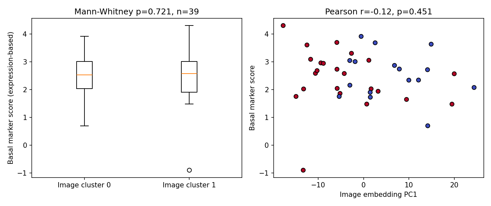

# Phase D: imaging embeddings vs. known TNBC biology

**Scope note:** the TCGA imaging cohort has no subtype ground truth (see README), so this is not a second supervised split. It's an exploratory check on whether frozen Phikon image embeddings, clustered without using any expression data, land on groups that differ in basal-marker expression computed independently from matched RNA-seq. n=39 - directional signal, not a claim.

- Tissue tiles: top-3 by tissue density per slide (of a 4x4 coarse grid), pulled directly from the GDC tile server (no full .svs download).
- Embedding: Phikon (owkin/phikon), CLS token, mean-pooled over each sample's tiles.
- Basal marker score: mean z-score of ['KRT5', 'KRT14', 'KRT17', 'EGFR', 'VIM', 'FOXC1'] minus mean z-score of ['ESR1', 'FOXA1', 'GATA3', 'PGR'].

## Result

| Image cluster | n | Basal score mean +/- std |
|---|---|---|
| 0 | 16 | 2.540 +/- 0.840 |
| 1 | 23 | 2.413 +/- 1.042 |

Mann-Whitney U p-value: **0.721**

Pearson r(image embedding PC1, basal score): **-0.124** (p=0.451)

